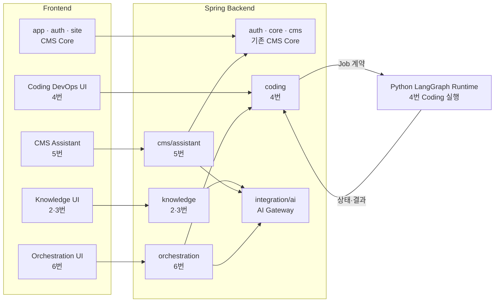
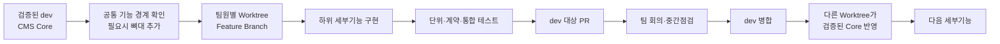

# AX Module Studio AI 핵심 기능 후속 고려사항

> 상태: 향후 제품 검토 후보
> 목적: 축소 CMS 완료 후 검토할 AI 핵심 기능의 방향만 보존
> 범위: 현재 CMS MVP 구현 기준이 아니며, 이 문서만으로 구현을 시작하지 않는다.

현재 구현 범위는
AX_Module_Studio_CMS_LOCAL_DEMO_MVP_SPEC_v1.0.md를 따른다. 아래 기능을 시작하려면 기능별
사용자 흐름, 권한, 데이터, 계약, 완료 기준을 별도 Spec으로 확정하고 구현 승인을 받아야 한다.

## 2. 도메인·RAG 교체

- 최고관리자가 공공데이터 API URL·인증 Key·요청 Parameter·응답 매핑을 등록하고 교체한다.
- Knowledge Build는 수집·파싱·정제·중복 제거·청킹·임베딩·Vector 적재·검색 평가 순서의
  고정 Pipeline으로 실행한다.
- Build마다 불변 Knowledge Version을 만들고, 승인된 Active Version Pointer만 전환한다.
- 사용자 페이지의 챗봇과 검색은 서버가 선택한 Active Version만 사용하며 임의 Version을
  조회하지 못하게 한다.
- 최고관리자는 Build 실행·실패 재시도·평가 승인·활성화·직전 Version 복구를 담당한다.
- 의미 기반 청킹 방식, 지원할 공공데이터 API 범주와 Key 보관 방식은 상세 기획에서 확정한다.

## 3. RAG 품질 개선

- Freshness, 수집 완전성, 필수 필드 누락률·중복률, Chunk 생성률, Embedding률,
  Vector Sync율과 Retrieval Hit@K·MRR·Citation·Refusal 결과를 Version 단위로 관리한다.
- 45일은 초기 검토값으로만 두고, 실제 경고 기준은 API 갱신주기와 데이터 특성에 맞게
  설정할 수 있도록 검토한다.
- 품질 저하 가능성을 관리자에게 경고하고 원인을 수집·매핑·청킹·임베딩·검색 평가 단계로
  나누어 보여준다.
- 일반관리자는 경고와 평가 근거를 확인해 최고관리자에게 재빌드를 요청하고, 최고관리자는
  최신 API 데이터로 새 Version을 Build·평가·활성화한다.
- 알림 전달 방식, 요청·처리 상태와 Golden Question 관리 위치는 상세 기획에서 확정한다.

## 4. 제한형 LLM DevOps

- 자연어 요청을 분석해 코딩 가능한 범위인지 판정한 뒤 격리 Worktree에서 Patch를 만들고,
  허용된 Test·Secret Scan·Path 검증·Diff·Preview를 수행한다.
- 자율코딩 결과, PR 생성, 배포의 세 Gate에서 서로 다른 GENERAL_ADMIN과
  SUPER_ADMIN의 이중 승인을 요구하는 방안을 기본 후보로 둔다.
- 최고관리자가 Repository별 쓰기 허용 경로를 PathPolicy Version으로 관리하고,
  인증·보안·Secret·Migration 등 고정 Denylist는 허용할 수 없게 한다.
- 검증과 승인은 정확한 Candidate SHA·Policy·Test 결과에 결합하며 Patch가 바뀌면
  기존 승인을 무효화한다.
- 자동 Merge와 운영 자동 배포는 기본 범위에 포함하지 않고, 로컬 오픈소스 모델과
  Fine-tuning은 핵심 Pipeline 검증 후 장기 후보로 둔다.
- 분석·코딩·리뷰 Agent 역할과 단계별 승인 위치는 상세 기획에서 확정한다.

## 5. 자연어 CMS 관리

- 일반관리자가 자연어로 메뉴, 콘텐츠·페이지와 사용자 화면 템플릿 변경을 요청할 수 있게 한다.
- LLM은 임의 HTML·CSS·JavaScript를 실행하지 않고 MenuSpec, PageSpec,
  SiteTemplateSpec 같은 구조화 Draft만 생성한다.
- 기존 Renderer, 허용 Component·Template Variant·Design Token·데이터 연결 범위 안에서만
  변경하고 Schema·접근성·권한 검증과 Desktop·Mobile Preview를 거친다.
- 자연어 CMS 변경은 메뉴·콘텐츠·템플릿 관리이며 새로운 애플리케이션 기능 추가와 구분한다.
- 게시 승인, Version·복구 범위와 상세 Guardrail은 후속 Spec에서 확정한다.

## 6. 오케스트레이션 제어

- 최고관리자가 OpenAI·Claude·Gemini 등 검증된 Provider의 Key와 작업별 Model Mapping을
  관리하는 방안을 검토한다. Key 원문은 저장 후 다시 표시하지 않는다.
- Python LangGraph Runtime은 고정 State Machine, Checkpoint, 재시도와 관리자 승인
  Interrupt를 담당하고, Spring Backend와 Core DB가 권한·Job 상태의 기준이 된다.
- 최고관리자가 Pipeline 작업에 Agent 역할을 배치하는 기능은 후보로 두되, 단계 순서를
  임의 재배선하는 자유 오케스트레이션보다 승인된 Workflow와 Tool Allowlist를 우선한다.
- OpenAI·Claude·Gemini Provider 세 개가 곧 Agent 세 개를 의미하지 않는다. Agent 역할,
  Provider·Model 선택과 3-Agent 구성 여부를 분리해 상세 기획에서 확정한다.
- Agent는 DB·Shell·Secret에 직접 접근하지 않고 승인된 Tool Gateway만 사용한다.

## 7. 후속 결정 원칙

- 다섯 영역을 한 번에 구현하지 않고 사용자 시연 가치가 큰 기능부터 굵직한 Slice로 확정한다.
- 새 화면·역할·상태·외부 연동·테이블을 만들기 전에 현재 범위와 최소 완료 기준을 승인한다.
- 기존 Spring AI, PostgreSQL·pgvector, Valkey, Python LangGraph 기반을 우선 재사용한다.
- 현재 축소 CMS의 완료 기준, API와 사용자·관리자 화면 동작을 임의로 변경하지 않는다.

## 8. 팀 작업용 구조

아래는 현재 리팩터링 기준의 작업 경계다. 담당자와 기능 경계가 정해지면 공통 구조 작업에서
Frontend 경계 폴더만 먼저 만들 수 있다. 빈 폴더는 `.gitkeep`으로 추적하며, 이 뼈대는
2~6번 기능 완료를 뜻하지 않는다. 실제 화면·계약·상태는 승인된 최소 완료 범위에 따라
각 기능 담당자가 구현한다.

### Frontend

```text
src/
├─ app/                         # App Shell, Router, Navigation
├─ features/
│  ├─ auth/                    # 현재 로그인·세션
│  ├─ site/                    # 현재 사용자 화면
│  ├─ cms/                     # 현재 CMS, 5번은 assistant 하위 경계
│  ├─ knowledge/               # 2·3번 배정 후 추가
│  ├─ coding/                  # 4번 배정 후 추가
│  └─ orchestration/           # 6번 배정 후 추가
├─ shared/api/                 # 공통 HTTP·오류·세션
└─ styles/                     # 공통 Token·Style
```

### Frontend 내부 가이드

기능 폴더는 처음부터 모든 하위 구조를 만들지 않고 필요한 파일만 평평하게 시작한다.

```text
features/<feature>/
├─ <Feature>Workspace.tsx      # Route 진입 화면이 필요할 때
├─ api.ts                      # Backend 계약을 사용할 때
├─ *.test.ts(x)                # 기능과 가까운 테스트
└─ components/                 # 화면 분리가 실제로 필요할 때
```

- Route와 Navigation 등록은 `app`에서 관리한다.
- 기능별 Backend 호출은 해당 기능의 `api.ts`에 두고 공통 HTTP·세션·오류 처리는 `shared/api`를 재사용한다.
- 상태는 React 로컬 상태를 기본으로 하며 여러 화면이 공유할 때만 기능 전용 Store를 추가한다.
- 공통 뼈대에는 샘플 데이터를 넣지 않는다. 계약이 정해진 뒤 기능 테스트 Fixture로 추가한다.
- 위 파일과 폴더는 필요한 시점에만 만들며 모든 기능에 같은 세부 구조를 강제하지 않는다.

### Spring Backend

각 기능 경계 안에서 필요한 Spring MVC 계층만 사용한다. 모든 하위 폴더를 의무적으로 만들지 않는다.

```text
backend/
├─ auth/                       # config/controller/dto/entity/repository/security/service
├─ cms/                        # bootstrap/controller/dto/entity/repository/service
│  └─ assistant/              # 5번 경계, 현재 package-info만 존재
├─ knowledge/                  # 2·3번: controller/dto/service/repository + batch 등
├─ coding/                     # 4번: controller/dto/service/repository + config/integration
├─ orchestration/              # 6번 Spring 제어 경계, 현재 package-info만 존재
├─ integration/
│  ├─ ai/                     # 공통 AI Gateway·Provider Adapter
│  └─ persistence/            # 공통 영속성 설정
├─ core/web/                   # 최소 공통 Web 기능
└─ health/                     # 상태 확인
```

`knowledge`와 `coding`의 현재 코드는 기존 기능을 이동한 기반이며 2~4번 신규 기능 완료를 뜻하지
않는다. `cms/assistant`와 `orchestration`도 배정 전에는 뼈대만 유지한다.

### 기능별 기본 소유 경계

| 기능 | Frontend | Spring Backend | Python LangGraph |
|---|---|---|---|
| 2·3 도메인·RAG | `features/knowledge` | `knowledge` | 기본 대상 아님 |
| 4 제한형 LLM DevOps | `features/coding` | `coding` | Coding 실행 Runtime |
| 5 자연어 CMS | `features/cms/assistant` | `cms/assistant` → 기존 `cms` 사용 | 기본 대상 아님 |
| 6 오케스트레이션 | `features/orchestration` | `orchestration` + `integration/ai` | 필요한 Coding 실행만 재사용 |

## 9. 저장소 간 간략 흐름



- Spring Backend가 API·권한·Job 상태·Core DB의 기준이다.
- Python LangGraph는 Coding 실행 흐름만 담당하고 Spring의 책임을 중복하지 않는다.
- 기능 패키지는 필요한 경우 `integration/ai`를 사용하며, 공통 코드를 각 기능에 복제하지 않는다.

## 10. 팀원 작업 흐름



- 담당자와 작업 ID는 내부회의 후 배정한다.
- 공통 경계 PR은 폴더와 최소 가이드만 준비하며 실제 기능 구현은 담당자 Branch에서 진행한다.
- 같은 기능의 저장소 변경은 같은 work slug를 쓰되 Branch·Commit·PR을 저장소별로 분리한다.
- 공통 계약·Flyway·App Shell·실행 환경은 합의된 통합 작업에서만 변경한다.
- 기능별 회귀 테스트를 통과한 작은 단위로 `dev`에 병합해 팀이 중간 점검한다.
