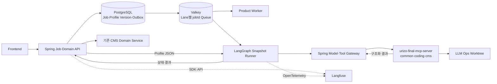

# AX Module Studio AI 핵심 기능 후속 고려사항

> 상태: 담당자 배정 완료 · 공통 계약 확정 · 기능별 최소 완료 범위 검토 중
> 목적: AI 핵심 기능의 공통 경계와 담당 문서를 짧게 보존
> 범위: 현재 CMS MVP 구현 기준이 아니며, 이 문서만으로 구현을 시작하지 않는다.

현재 구현 범위는 `AX_Module_Studio_CMS_LOCAL_DEMO_MVP_SPEC_v1.0.md`를 따른다. 아래 기능은 기능별
사용자 흐름, 권한, 데이터, 계약과 완료 기준을 확정하고 별도 승인을 받은 뒤 구현한다.

## 기능별 담당 및 상세 문서

| 기능 | 담당자 | GitHub ID | 상세 문서 |
|---|---|---|---|
| 2. 도메인·RAG 교체 | 민은지 | `emilyjjang-jpg` | [`02_DOMAIN_RAG_REPLACEMENT.md`](ai-core/02_DOMAIN_RAG_REPLACEMENT.md) |
| 3. RAG 품질 개선 | 민은지 | `emilyjjang-jpg` | [`03_RAG_QUALITY.md`](ai-core/03_RAG_QUALITY.md) |
| 4. 제한형 LLM DevOps | 장차윤 | `jcy644542` | [`04_LIMITED_LLM_DEVOPS.md`](ai-core/04_LIMITED_LLM_DEVOPS.md) |
| 5. 자연어 CMS 관리 | 이재욱 | `LEEJAEWOOK1` | [`05_NATURAL_LANGUAGE_CMS.md`](ai-core/05_NATURAL_LANGUAGE_CMS.md) |
| 6. 오케스트레이션 제어 | 민승준 | `tmdwns0531` | [`06_ORCHESTRATION_CONTROL.md`](ai-core/06_ORCHESTRATION_CONTROL.md) |

기능별 기획, 업무 의미, 완료 기준, 작업 ID와 진행 상태는 담당 상세 문서에서 관리한다. 다른 담당자는
해당 문서를 임의로 변경하지 않으며 공통 계약이 달라질 때만 관련 담당자와 함께 확인한다.

## 공통 확정 계약

대화 순서를 기록하던 F 번호는 구현 기준으로 사용하지 않는다. 공통 문서에는 실제 구현자가 함께 알아야 하는
계약만 남기고 UI 목업, 조사 이력과 기능별 세부 흐름은 담당 문서에서 관리한다.

| 핵심 영역 | 공통 확정 내용 |
|---|---|
| 실행 원본 | 활성 Versioned Snapshot JSON의 `nodes`, `edges`, `config`가 실행 순서·조건·허용된 반복·승인·반려 경로의 유일한 원본이다. |
| 4번 소유 | LLM Ops Job Domain·화면·완료 기준과 `LLM_OPS` Profile 내용, 전용 Node Handler·Coding MCP Tool의 기능 로직·테스트를 소유한다. 다음 Node는 선택하지 않는다. |
| 5번 소유 | Natural CMS Job Domain·화면·Resource·게시 완료 기준과 `NATURAL_CMS` Profile 내용, 전용 Node Handler·CMS MCP Tool의 기능 로직·테스트를 소유한다. 다음 Node는 선택하지 않는다. |
| 6번 소유 | Agent 설정, Template 시스템, JSON Loader·Snapshot Runner·Graph Builder·Node Registry·공통 Runtime, Approval·Check·Guardrail 공통 Handler와 MCP 공통 플랫폼·계약을 소유한다. |
| Job·Queue | 요청 하나를 Job 하나로 관리한다. Queue Lane은 Product·Coding·Natural CMS 세 개이며 PostgreSQL이 상태의 기준이다. Valkey Queue에는 `jobId`만 저장한다. |
| LLM Ops | Coding Job만 영향 Repository별 Worktree·Candidate SHA·Repository별 PR을 사용한다. |
| 자연어 CMS | Git Worktree·Candidate SHA·PR을 사용하지 않는다. 승인된 결과는 기존 Spring CMS Domain Service가 Transaction으로 저장하고 CMS Version으로 게시한다. |
| MCP | 계획 저장소 `urizo-final-mcp-server` 하나에서 Service·Catalog 하나와 `common`, `coding`, `cms` Package를 사용한다. MCP는 Core DB에 직접 접근하지 않는다. |
| 관측 | Langfuse는 Self-host·Pipeline Node가 아니라 SDK·OpenTelemetry·API 기반 횡단 추적이다. |
| 변경 경계 | 등록된 Handler·결과 Port 안의 Node 재배치, Review 횟수, Check·Approval 위치와 승인·반려 Edge 변경은 Template Version 변경으로 끝낸다. 새로운 Handler·결과 Port·Domain 부작용이 생길 때만 관련 기능 담당자와 6번이 공통 계약과 Source를 함께 변경한다. |

### 공통 계약 안의 자율 구현·수정

4·5번 담당자는 6번의 사전 요청·승인 없이 자신의 Profile과 전용 Handler·MCP Package를 구현하고
버그를 수정할 수 있다. 단, 다음 공통 계약을 모두 유지해야 한다.

| 자율 수정 가능 | 6번과 공동 변경 필요 |
|---|---|
| 기존 `handlerKey` 내부 기능 로직·오류 처리·테스트 | 새로운 `handlerKey`·Node Type 등록 |
| 기존 Tool 이름과 입출력 계약 안의 Coding·CMS Tool 로직 | 공통 Tool 호출 형식·기존 Tool 입출력 계약 또는 Catalog·Allowlist 구조 변경 |
| 기존 Result Port 안의 반환 조건·내부 계산 | 새로운 Result Port 또는 Port 의미 변경 |
| 담당 Profile의 Node·Edge·Config와 Scenario Fixture | Snapshot Schema·Runner·Registry·Checkpoint 변경 |
| 담당 Package 내부 리팩터링과 회귀 테스트 | 공통 Approval·Check·Guardrail, 인증·권한·보안 경계 변경 |
| 담당 Spring Domain만 사용하는 내부 Table 추가 | 공통 Job·Profile·Approval Table과 공유 Column·Status·관계 변경 |

자율 수정은 MCP의 Core DB 직접 접근 금지, 임의 Shell 금지, 고정 Tool Allowlist, Workspace·Resource 권한,
잠금 Guardrail과 Spring Domain Service 최종 저장 원칙을 우회할 수 없다. 변경한 담당자는 공통 Contract Test와
자신의 기능 Scenario Test를 통과시킨다. 공통 계약이나 다른 기능의 부작용이 달라질 때만 관련 담당자와 6번이
함께 변경한다.
승인된 Work ID 안에서 공통 호출 형식·인증·권한·Spring 최종 저장 경계를 유지하는 `coding`·`cms`
기능 전용 leaf Tool의 병렬 추가와 미사용 Tool 삭제는 담당 기능 변경으로 처리한다. Catalog·Allowlist·Profile 참조와
Contract·Scenario Test를 함께 갱신하며, 삭제 전 활성 Profile·Snapshot과 다른 소비자의 참조가 없음을 확인한다.
기능 전용 내부 Table도 Spring Domain과 Flyway 예약·검증 규칙을 따르며 다른 기능의 공유 계약으로 만들지 않는다.
공통 Table의 구조·Column·상태·관계 변경은 관련 담당자와 오프라인 협의 후 공동 변경한다.

## Snapshot과 Job 실행 계약

### 불변 Profile Version

| 값 | 역할 |
|---|---|
| `contractVersion` | Spring과 Orchestrator가 함께 해석할 계약 Version |
| `profileVersionId`, `profileKey`, `profileVersion` | Job이 고정해 참조할 불변 LLM_OPS·NATURAL_CMS Profile Version |
| `nodes` | 허용 Node Type, Node ID, `handlerKey`와 Node별 설정 |
| `edges` | 시작 Node, 결과 Port와 다음 Node 연결 |
| `config` | 최대 Node·Attempt와 허용된 제한형 반복 같은 Profile 공통 실행 설정 |
| `modelBindings` | Agent Node별 기본·대체 Model |
| `toolPolicy` | Profile별 허용 Coding·CMS Tool |
| `guardrailProfileKey` | 자동 삽입되고 삭제·비활성화할 수 없는 Guardrail Profile |

`jobId`, `pipelineAttempt`, `executionAttempt`, `stateVersion`, `workspaceId`, `toolCallId`, `traceId`는
Profile Version에 저장하지 않는다. Job 실행 Envelope와 Node 호출 Context로 전달한다.

### 제한형 Snapshot Runner

- Spring은 Job 생성 시 활성 `profileVersionId`를 고정하고 Job·Outbox를 PostgreSQL에 저장한다.
- Orchestrator는 Core DB에 직접 접근하지 않고 Spring에서 Job에 고정된 JSON을 받는다.
- 6번 공통 Runner는 `handlerKey`를 Registry 함수에 연결하고 `add_node`, `add_edge`, 조건부 Edge와
  `compile()`을 수행해 메모리 실행 객체를 만든다.
- Handler는 작업 결과와 등록된 결과 Port를 반환하고 Runner가 Snapshot Edge로 다음 Node를 선택한다.
- 4·5번 Backend는 원자 Domain 상태 변경과 조회 API를 제공하지만 다음 Node를 선택하지 않는다.
- Start·End, 허용 Node·Handler, 필수 잠금 Guardrail, Port 연결, 도달 가능성과 최대 Node 수를 통과한
  DRAFT만 ACTIVE Version으로 전환한다.
- 병렬 실행, Sub-workflow, 임의 Cycle, 사용자 정의 Node와 동적 MCP 등록은 초기 범위에서 제외한다.
- LangGraph `compile()`은 바이너리·Script·공유 파일을 만들지 않는다. 초기에는 Compile Cache도 만들지 않는다.

## Job·Queue·상태

- Queue Lane은 Product, Coding, Natural CMS 세 개만 둔다.
- Product Queue는 Connector Sync·Knowledge Build와 담당자가 확정한 장시간 RAG Quality Job을 처리한다.
- Coding Queue는 LLM Ops Coding Job을 처리하고 초기 동시 활성 Job은 1개로 제한한다.
- Natural CMS Queue는 자연어 CMS Job만 처리한다.
- 일반 CMS CRUD와 개별 MCP Tool Call은 별도 Job을 만들지 않는다. Tool Call은 기존 Job의 `toolCallId`로 기록한다.
- PostgreSQL이 Job 상태의 기준이다. Job·Outbox를 같은 DB Transaction에 기록하고 Valkey Queue에는 `jobId`만 전달한다.
- 중복 전달은 DB 상태, `stateVersion`, Lease와 멱등키로 차단하고 시작 시 `QUEUED` Job과 만료 Lease를 복구한다.
- `WAITING_APPROVAL`은 PostgreSQL과 LangGraph Checkpoint에 저장하고 Worker Lease를 점유하지 않는다.
- 업무 반려는 `pipelineAttempt`, Timeout·Provider 오류 같은 기술 재시도는 `executionAttempt`로 구분한다.

## Profile별 기능 차이

| 구분 | LLM_OPS | NATURAL_CMS |
|---|---|---|
| 기능 소유 | 4번 | 5번 |
| Queue | Coding | Natural CMS |
| 작업 대상 | 필요한 Source Repository | 기존 CMS Resource |
| 격리 | 영향 Repository별 Git Worktree | Git Worktree 없음 |
| 검토 결과 | Candidate SHA·Diff·기능 Preview | 구조화 Command·Preview |
| 승인 후 | Branch Push·Repository별 PR | 재검증·Spring CMS Domain Service 반영·CMS Version 게시 |
| 반려 후 | Candidate 무효화·Worktree 폐기·같은 Job 분석 회귀 | Preview 무효화·폐기·같은 Job 분석 회귀 |

승인 역할, 상태 이름, 완료·실패 조건과 필요한 Result Port는 각 기능 담당자가 확정한다. 기존 Handler·Port로
표현할 수 없는 결과가 필요하면 관련 기능 담당자와 6번이 공통 계약을 먼저 갱신한다.

## MCP 경계

```text
urizo-final-mcp-server
├─ common
├─ coding
└─ cms
```

- Git Repository, Container, Service Endpoint와 Tool Catalog는 각각 하나만 두고 공통 골격·계약은 6번이 소유한다.
- `common` Package와 인증·Allowlist·공통 호출 Adapter는 6번이 구현·수정한다.
- `coding` Package는 4번이 소유하며 Job별 Worktree의 승인된 파일·Git·검사 Tool 로직과 테스트를 구현·수정한다.
- `cms` Package는 5번이 소유하며 구조화 Command의 대상 확인·검증·Preview·재검증 Tool 로직과 테스트를 구현·수정한다.
- Spring은 유효 Job, 고정 Tool Allowlist와 Workspace·CMS 권한을 확인한 뒤 MCP를 호출한다.
- MCP는 Core DB에 직접 접근하지 않는다. CMS 최종 DB Transaction과 Version 게시는 기존 Spring CMS Domain Service가 수행한다.
- 임의 MCP Server·Tool·Shell, Marketplace, 복잡한 Policy DSL과 다중 MCP Routing은 초기 범위에서 제외한다.
- 별도 MCP Repository 생성과 실제 Service 계약은 새 Work ID 승인 후 진행한다.

## 전체 목표 아키텍처



Spring과 PostgreSQL이 Job·권한·Profile Version·Domain 상태의 기준이다. LangGraph는 검증된 Snapshot을
조립·실행하고 MCP는 고정 Tool만 수행한다. 세 Runtime은 서로의 저장 책임을 중복하지 않는다.

## 기능별 전달 상태

| 기능 | 공통 전달 내용 | 상태 |
|---|---|---|
| 2. 도메인·RAG | Product Queue Job Type·공통 Job Envelope·복구 | 담당자 검토 제안 |
| 3. RAG 품질 | 장시간 재평가·재빌드 Job Type·공통 Job Envelope·복구 | 담당자 검토 제안 |
| 4. LLM DevOps | Coding Job Domain·`LLM_OPS` Profile 내용·전용 Handler·Coding Tool 구현·테스트 | 담당 문서 소유권 문구 현행화 필요 |
| 5. 자연어 CMS | Natural CMS Job Domain·`NATURAL_CMS` Profile 내용·전용 Handler·CMS Tool 구현·테스트 | 담당 문서 소유권 문구 현행화 필요 |
| 6. 오케스트레이션 | Provider·Model·Template 시스템·공통 Runtime·Handler·MCP 플랫폼 계약 | 6번 소유 |

## 구현 전 확인

- 2·3번 담당자는 Agent 설정이 아니라 Queue·Job Type과 복구 계약만 확인한다.
- 4·5번 담당자는 Job 입력·Domain 상태·승인 역할·실패와 완료 기준을 확정하고 6번 Profile 계약과 맞춘다.
- 6번은 Versioned Snapshot과 공통 실행 플랫폼을 제공하고 4·5번 Domain 상태를 소유하지 않는다.
- 조사·분석과 기능 MD 수정만이면 Worktree를 만들지 않는다. 실제 Source 구현은 Work ID 승인 후 저장소별
  최신 `origin/dev` 기반 독립 Worktree와 Feature Branch에서 시작한다.
- 같은 기능의 여러 저장소 변경은 같은 work slug를 사용하되 Branch·Commit·PR을 저장소별로 분리한다.
- 공통 계약·Flyway·App Shell·실행 환경은 합의된 통합 작업에서만 변경한다.
- 세부 Work ID, PR 연결과 상태 기록은 `MASTER_SOURCE_NOTION_OPERATING_POLICY_v0.1.md`만 따른다.
