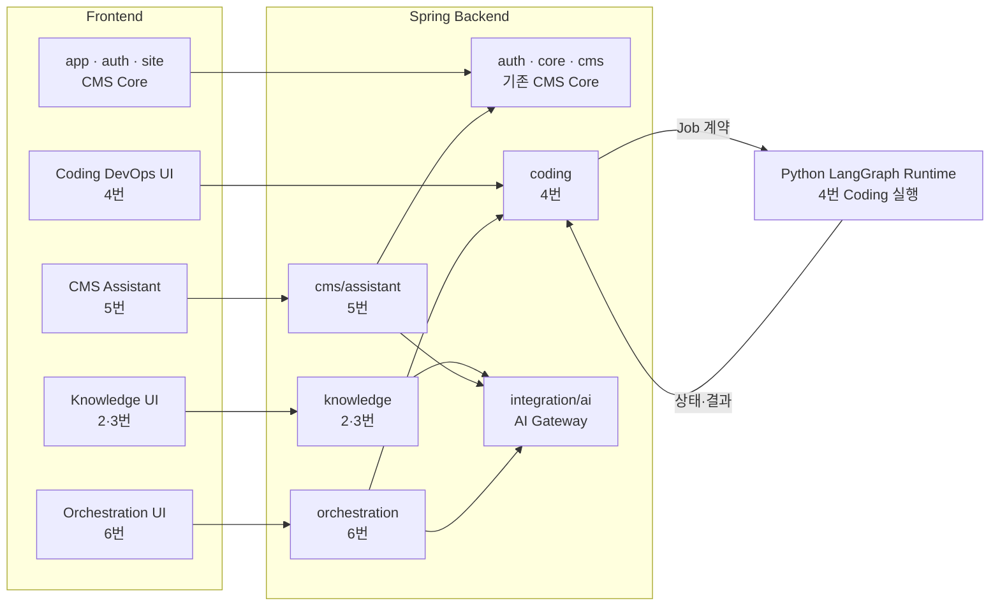

# AX Module Studio AI 핵심 기능 후속 고려사항

> 상태: 담당자 배정 완료 · 기능별 심층 조사와 방향 수립 중 · 중간점검 전
> 목적: AI 핵심 기능의 공통 경계, 담당 문서와 팀 작업 흐름을 보존
> 범위: 현재 CMS MVP 구현 기준이 아니며, 이 문서만으로 구현을 시작하지 않는다.

현재 구현 범위는
AX_Module_Studio_CMS_LOCAL_DEMO_MVP_SPEC_v1.0.md를 따른다. 아래 기능을 시작하려면 기능별
사용자 흐름, 권한, 데이터, 계약, 완료 기준을 별도 Spec으로 확정하고 구현 승인을 받아야 한다.

이 문서는 공통 기준만 관리한다. 기능별 기획, 방향, 작업 ID와 진행 상태는 담당 상세 문서에서
관리하며 다른 담당자가 임의로 변경하지 않는다.

## 2~6. 기능별 담당 및 상세 문서

| 기능 | 담당자 | GitHub ID | 상세 문서 |
|---|---|---|---|
| 2. 도메인·RAG 교체 | 민은지 | `emilyjjang-jpg` | [`02_DOMAIN_RAG_REPLACEMENT.md`](ai-core/02_DOMAIN_RAG_REPLACEMENT.md) |
| 3. RAG 품질 개선 | 민은지 | `emilyjjang-jpg` | [`03_RAG_QUALITY.md`](ai-core/03_RAG_QUALITY.md) |
| 4. 제한형 LLM DevOps | 장차윤 | `jcy644542` | [`04_LIMITED_LLM_DEVOPS.md`](ai-core/04_LIMITED_LLM_DEVOPS.md) |
| 5. 자연어 CMS 관리 | 이재욱 | `LEEJAEWOOK1` | [`05_NATURAL_LANGUAGE_CMS.md`](ai-core/05_NATURAL_LANGUAGE_CMS.md) |
| 6. 오케스트레이션 제어 | 민승준 | `tmdwns0531` | [`06_ORCHESTRATION_CONTROL.md`](ai-core/06_ORCHESTRATION_CONTROL.md) |

### 4·6번 공통 확정 경계

- LLM DevOps는 4번 상세 문서에 확정된 요구사항 분석·코딩·코드 리뷰 3-Agent 흐름을 사용한다.
- 최고관리자가 Provider Key를 등록하고 각 Agent 단계에 사용할 Provider·Model을 매핑한다.
- 4번 담당자는 DevOps 단계·승인·코딩 결과의 의미를, 6번 담당자는 Provider·Model·Agent 매핑과
  오케스트레이션·모니터링을 결정한다. 공통 계약 변경은 두 담당자가 함께 확인한다.
- Frontend의 현재 `AI 운영 > Agent 관리`, Provider·Model 관리, LLM DevOps와 승인 관리 Mock UI를 기준으로
  검토하되 실제 Route·API·상태 구현은 담당 기능의 승인된 범위에서 진행한다.

## 7. 후속 결정 원칙

- 다섯 영역을 한 번에 구현하지 않고 사용자 시연 가치가 큰 기능부터 굵직한 Slice로 확정한다.
- 새 화면·역할·상태·외부 연동·테이블을 만들기 전에 현재 범위와 최소 완료 기준을 승인한다.
- 기존 Spring AI, PostgreSQL·pgvector, Valkey, Python LangGraph 기반을 우선 재사용한다.
- 현재 축소 CMS의 완료 기준, API와 사용자·관리자 화면 동작을 임의로 변경하지 않는다.

## 8. 팀 작업용 구조

아래는 현재 리팩터링 기준의 작업 경계다. Frontend 기능 경계는 준비됐으며, 빈 폴더는
`.gitkeep`으로 추적한다. 이 뼈대는 2~6번 기능 완료를 뜻하지 않는다. 실제 화면·계약·상태는
승인된 최소 완료 범위에 따라 각 기능 담당자가 구현한다.

### Frontend

```text
src/
├─ app/                         # App Shell, Router, Navigation
├─ features/
│  ├─ auth/                    # 현재 로그인·세션
│  ├─ site/                    # 현재 사용자 화면
│  ├─ cms/                     # 현재 CMS, 5번은 assistant 하위 경계
│  ├─ knowledge/               # 2·3번 경계 준비
│  ├─ coding/                  # 4번 경계 준비
│  └─ orchestration/           # 6번 경계 준비
├─ shared/api/                 # 공통 HTTP·오류·세션
└─ styles/                     # 공통 Token·Style
```

### Frontend 내부 가이드

기능 폴더는 처음부터 모든 하위 구조를 만들지 않고 필요한 파일만 평평하게 시작한다.

```text
features/<feature>/
├─ <Feature>Workspace.tsx      # Route 진입 화면이 필요할 때
├─ api.ts                      # Backend 계약을 사용할 때
├─ *.test.ts(x)                # 기능과 가까운 테스트
└─ components/                 # 화면 분리가 실제로 필요할 때
```

- Route와 Navigation 등록은 `app`에서 관리한다.
- 기능별 Backend 호출은 해당 기능의 `api.ts`에 두고 공통 HTTP·세션·오류 처리는 `shared/api`를 재사용한다.
- 상태는 React 로컬 상태를 기본으로 하며 여러 화면이 공유할 때만 기능 전용 Store를 추가한다.
- 공통 뼈대에는 샘플 데이터를 넣지 않는다. 계약이 정해진 뒤 기능 테스트 Fixture로 추가한다.
- 위 파일과 폴더는 필요한 시점에만 만들며 모든 기능에 같은 세부 구조를 강제하지 않는다.

### Spring Backend

각 기능 경계 안에서 필요한 Spring MVC 계층만 사용한다. 모든 하위 폴더를 의무적으로 만들지 않는다.

```text
backend/
├─ auth/                       # config/controller/dto/entity/repository/security/service
├─ cms/                        # bootstrap/controller/dto/entity/repository/service
│  └─ assistant/              # 5번 경계, 현재 package-info만 존재
├─ knowledge/                  # 2·3번: controller/dto/service/repository + batch 등
├─ coding/                     # 4번: controller/dto/service/repository + config/integration
├─ orchestration/              # 6번 Spring 제어 경계, 현재 package-info만 존재
├─ integration/
│  ├─ ai/                     # 공통 AI Gateway·Provider Adapter
│  └─ persistence/            # 공통 영속성 설정
├─ core/web/                   # 최소 공통 Web 기능
└─ health/                     # 상태 확인
```

`knowledge`와 `coding`의 현재 코드는 기존 기능을 이동한 기반이며 2~4번 신규 기능 완료를 뜻하지
않는다. `cms/assistant`와 `orchestration`도 승인된 최소 완료 범위가 정해질 때까지 뼈대만 유지한다.

### 기능별 기본 소유 경계

| 기능 | Frontend | Spring Backend | Python LangGraph |
|---|---|---|---|
| 2·3 도메인·RAG | `features/knowledge` | `knowledge` | 기본 대상 아님 |
| 4 제한형 LLM DevOps | `features/coding` | `coding` | Coding 실행 Runtime |
| 5 자연어 CMS | `features/cms/assistant` | `cms/assistant` → 기존 `cms` 사용 | 기본 대상 아님 |
| 6 오케스트레이션 | `features/orchestration` | `orchestration` + `integration/ai` | 필요한 Coding 실행만 재사용 |

## 9. 저장소 간 간략 흐름



- Spring Backend가 API·권한·Job 상태·Core DB의 기준이다.
- Python LangGraph는 Coding 실행 흐름만 담당하고 Spring의 책임을 중복하지 않는다.
- 기능 패키지는 필요한 경우 `integration/ai`를 사용하며, 공통 코드를 각 기능에 복제하지 않는다.

## 10. 팀원 작업 흐름

```mermaid
flowchart LR
    ASSIGN["담당자 배정 완료"] --> RESEARCH["기능별 심층 조사<br/>방향 수립"]
    RESEARCH --> CHECK["팀 중간점검"]
    CHECK --> SCOPE["사용자 흐름·계약<br/>최소 완료 기준 확정"]
    SCOPE --> UNIT["담당자가 하위 작업<br/>단위 결정"]
    UNIT --> START["작업 시작 시<br/>Work ID·slug 제안"]
    START --> RECORD["동의 후 작업 목록과<br/>진행 상태 등록"]
    RECORD --> WT["검증된 dev 기반 Worktree<br/>Feature Branch"]
    WT --> S1["세부기능 구현"]
    S1 --> TEST["단위·계약·통합 테스트"]
    TEST --> LINK["PR 생성 시<br/>문서 연결 제안"]
    LINK --> PR["dev 대상 PR"]
    PR --> DAILY["일일 팀 중간점검<br/>기능 담당자·팀 검토"]
    DAILY --> MERGE["dev 병합"]
    MERGE --> TRACK["다음 SessionStart에서<br/>병합 결과 자동 현행화"]
    TRACK --> SYNC["다른 Worktree가<br/>검증된 Core 반영"]
    SYNC --> S2["다음 세부기능"]
```



- 담당자 배정은 완료됐으며 현재 각 담당자가 심층 조사와 방향 수립을 진행한다.
- 하위 작업을 어디부터 어디까지 나눌지는 해당 기능 담당자가 결정한다.
- Work ID 하나는 작업 시작 제안부터 PR 생성까지의 한 주기다. 같은 PR에 들어가는 구현·테스트·문서·수정은
  한 Work ID 아래 여러 작업으로 목록화하고, 독립된 다음 결과물이나 다음 PR부터 새 Work ID를 사용한다.
- 실제 새 작업 지시를 받았는데 사용할 Work ID가 없으면 LLM이 기능별 `AI02-001`~`AI06-001` 다음 번호와
  work slug를 한 번 제안한다. 담당자가 동의하면 작업 목록과 진행 상태를 담당 상세 문서에 기록한다.
- 조사·분석과 기능 MD 수정만이면 Worktree를 만들지 않는다. 실제 Source 구현은 Work ID 승인 후 저장소별
  최신 `origin/dev` 기반 독립 Worktree와 Feature Branch에서 시작한다. 같은 PR은 재사용하고 다음 독립 PR은 새로 만든다.
- 각 기능의 내용은 해당 담당자가 최종 판단하며, 다른 담당자의 기능 문서를 임의로 변경하지 않는다.
- 공통 경계는 준비됐으며 실제 기능 구현은 중간점검과 최소 완료 기준 확정 후 담당자 Branch에서 진행한다.
- 같은 기능의 저장소 변경은 같은 work slug를 쓰되 Branch·Commit·PR을 저장소별로 분리한다.
- PR 생성 시 LLM은 해당 Work ID에 PR 정보를 연결할지 한 번 제안한다. 동의해 PR 링크가 기록되면
  이후 SessionStart에서 실제 GitHub 상태를 확인하고 병합 결과를 추가 질문 없이 현행화한다.
- Hook은 현재 GitHub ID, 담당 기능, 진행 Work ID와 추적할 PR을 LLM에 알려주며 기능 문서를 직접 수정하지 않는다.
  전체 Commit 이력은 Git과 GitHub를 기준으로 조회하고 기능 문서에 중복 보관하지 않는다.
- 공통 계약·Flyway·App Shell·실행 환경은 합의된 통합 작업에서만 변경한다.
- 기능별 회귀 테스트를 통과한 작은 단위로 `dev`에 병합해 팀이 통합 점검한다.
